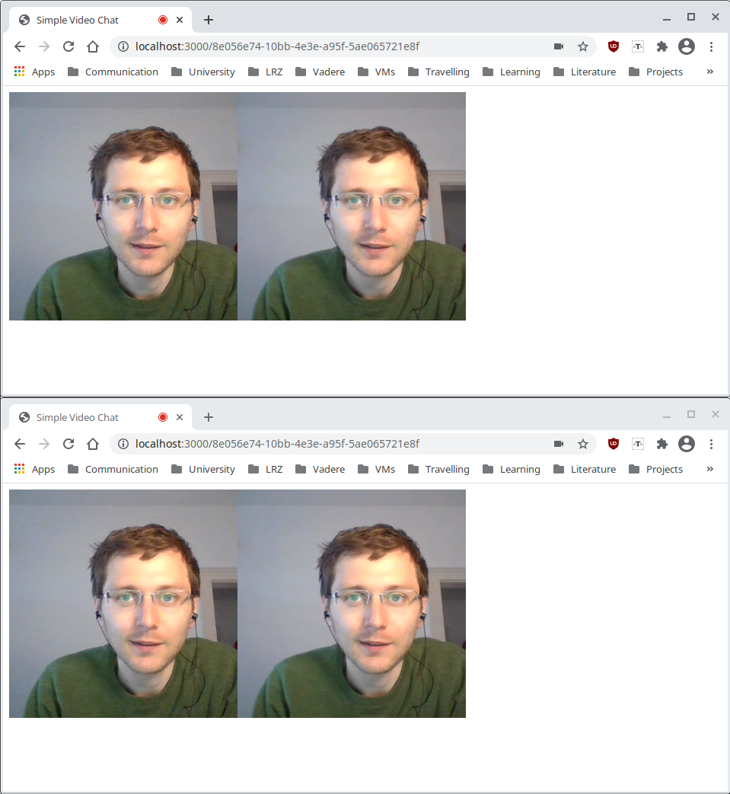

# README

A simple WebRTC-based video chat program that runs in the browser. New chat rooms are created by the webserver and users are directed to exisiting chat rooms by the server. Participants are communicating directly with each other and no server is required.

Idea: https://www.youtube.com/watch?v=DvlyzDZDEq4

## Important Dependencies

- express.js from Node.js is used as webserver
- socket.io is used to communicate with the webserver from the client (the HTML web interface)
- peer.js is used to as wrapper for the WebRTC communcation (calling, answering calls etc.)

## Getting Started

1. `npm install`
2. `npm run start`
3. `npm run stop`
